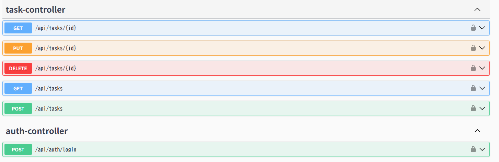

# Task API

JWT認証付きのタスク管理REST APIです。  
Spring Boot を使用して、ユーザーごとのタスク管理機能を実装しています。

このプロジェクトは **バックエンドポートフォリオ**として作成しました。

---

# Live Demo

http://3.112.213.52:8080/swagger-ui/index.html

Swagger UI

```
https://your-domain/swagger-ui/index.html
```

---

# Overview

ユーザー認証付きのタスク管理APIです。  
JWT認証を利用し、ユーザーごとにタスクを管理できるようになっています。

主な特徴

- JWT認証
- Roleベースのアクセス制御
- タスク所有者制御（他ユーザーのタスクアクセス禁止）
- ページング対応
- タスク検索
- FlywayによるDBマイグレーション管理
- DockerによるDB環境管理

- # API Preview

### Swagger UI



---

# Tech Stack

| 技術 | 用途 |
|---|---|
| Java 17 | プログラミング言語 |
| Spring Boot | APIフレームワーク |
| Spring Security | 認証 / 認可 |
| JWT | トークン認証 |
| Spring Data JPA | ORM |
| PostgreSQL | データベース |
| Flyway | DBマイグレーション |
| Docker Compose | DB環境 |
| Swagger (OpenAPI) | APIドキュメント |

---

# Architecture

```
Client
   ↓
Spring Boot API
   ↓
PostgreSQL
```

アプリケーション構造

```
Controller
   ↓
Service
   ↓
Repository
   ↓
Database
```

DTOを使用して **EntityとAPIレスポンスを分離**しています。

---

# Design Decisions

## Why JWT Authentication

認証方式にはJWTを採用しました。  
サーバー側でセッションを保持しないため、ステートレスな認証ができる。

- フロントエンドとバックエンドを分離しやすい
- REST APIと相性が良い

---

## Why DTO Separation

EntityをそのままAPIの入出力に使わず、DTOを分離しました。

- APIレスポンスの構造を明確にできる
- Entityの内部構造を外部に直接公開しなくて済む
- 入力用DTOと出力用DTOを分けることで責務を整理できる

---

## Why Global Exception Handling

例外処理は `GlobalExceptionHandler` に集約しました。

これにより、

- エラーレスポンスの形式を統一できる
- Controllerごとに個別の例外処理を書かなくて済む
- 400 / 401 / 403 / 404 などの扱いを明確にできる

API利用者にとっても、一定の形式でエラー内容を確認できるようになります。

---

## Why Pagination and Search

タスク一覧取得では、ページングと検索を実装しました。

理由

- データ件数が増えた場合でもレスポンスを安定させるため
- 実際の業務アプリケーションでは一覧系APIにページングが必要になるため
- タイトルやステータスによる検索はタスク管理APIとして自然な要件であるため

単純なCRUDだけではなく、実際の利用を意識したAPIにするために追加しました。

---

## Why Role-based Authorization

認可では USER / ADMIN のロールを持たせました。

- 認証済みユーザーかどうかだけでなく、権限の違いを表現できる
- 将来的に管理者専用機能を追加しやすい

権限の差別化には興味があったので触れてみました。

---

## Why Owner-based Authorization

ロール制御だけではなく、タスクの所有者制御も実装しました。

- 一般ユーザーは自分が作成したタスクのみ参照・更新・削除可能
- 管理者は全ユーザーのタスクを操作可能

単純に「ADMINだけ更新可能」とするよりも、実際のタスク管理アプリに近い認可ルールになるため、この方式を採用しました。

---

## Why PostgreSQL

開発初期はH2を使用していましたが、最終的にはPostgreSQLに切り替えました。

- 本番運用を意識したDBを使いたかったため
- H2と実運用DBでは挙動差があるため
- 実務に近い構成でポートフォリオを作りたかったため(オープンソースであり、AWSでもサポートされている)

---

## Why Flyway

DBスキーマ管理にはFlywayを採用しました。

- DBの変更をSQLで管理できる。つまりgitで管理できるため
- 環境ごとの差異を減らせる

Hibernateの自動DDLに依存せず、DB変更を明示的に管理することで、より実務に近い構成にしました。

---

## Why Docker Compose

ローカルでのPostgreSQL起動にはDocker Composeを使用しました。

- 開発環境を簡単に再現できる
- ローカルPCに直接DBをインストールしなくてもよい
- 他の人が同じ手順で環境を再現しやすいため

再現性を高めるために、DB環境はComposeで管理しています。

# Features

## Authentication

JWTトークンを使用した認証を実装しています。

```
POST /api/auth/login
```

ログイン成功後にJWTを発行し、以降のAPIリクエストで使用します。

```
Authorization: Bearer {token}
```

---

## Task Management

| Method | Endpoint | Description |
|---|---|---|
| POST | /api/tasks | タスク作成 |
| GET | /api/tasks | タスク一覧 |
| GET | /api/tasks/{id} | タスク取得 |
| PUT | /api/tasks/{id} | タスク更新 |
| DELETE | /api/tasks/{id} | タスク削除 |

---

## Pagination

```
GET /api/tasks?page=0&size=20
```

---

## Search

```
GET /api/tasks?q=book
GET /api/tasks?status=TODO
```

---

---

# API Example

## 1. Login

JWTトークンを取得します。

Request

```
POST /api/auth/login
```

Example body

```json
{
  "username": "user",
  "password": "password"
}
```

Response

```json
{
  "token": "jwt_token_here"
}
```

---

## 2. Create Task

JWTトークンを使用してタスクを作成します。

Request

```
POST /api/tasks
Authorization: Bearer {token}
```

Example body

```json
{
  "title": "Buy book",
  "description": "Spring Boot book",
  "status": "TODO"
}
```

---

## 3. Get Tasks

タスク一覧を取得します。

```
GET /api/tasks?page=0&size=20
Authorization: Bearer {token}
```

---

## 4. Search Tasks

タイトルまたはステータスで検索できます。

```
GET /api/tasks?q=book
GET /api/tasks?status=TODO
```

Authorization header is required for all task endpoints.

# Security Design

## JWT Authentication

ログイン時にJWTトークンを発行し、APIアクセス時に検証します。  
APIはステートレスで動作します。

---

## Role Authorization

| Role | 権限 |
|---|---|
| USER | タスク操作 |
| ADMIN | 全ユーザーのタスク管理 |

---

## Owner Authorization

ユーザーは **自分が作成したタスクのみアクセス可能**です。

```
userA → userBのタスクアクセス → 403 Forbidden
```

---

# Database

PostgreSQL を使用しています。

DBスキーマ管理は **Flyway** を使用しています。

```
src/main/resources/db/migration
```

例

```
V1__init.sql
```

---

# Run Locally

## 1. PostgreSQL起動

```
docker compose up -d
```

---

## 2. アプリ起動

```
./mvnw spring-boot:run -Dspring-boot.run.profiles=prod
```

---

## 3. Swagger

```
http://localhost:8080/swagger-ui/index.html
```

---

# Error Handling

| Status | Description       |
|--------|-------------------|
| 400    | Validation Error  |
| 401    | Unauthorized      |
| 403    | Forbidden         |
| 404    | Resource Not Found |

---

# Future Improvements

- APIテスト（JUnit / MockMvc）
- Docker Compose に API コンテナ追加
- CI/CD（GitHub Actions）
- フロントエンドUI
- AWSデプロイ

---

# Author

Portfolio Project
